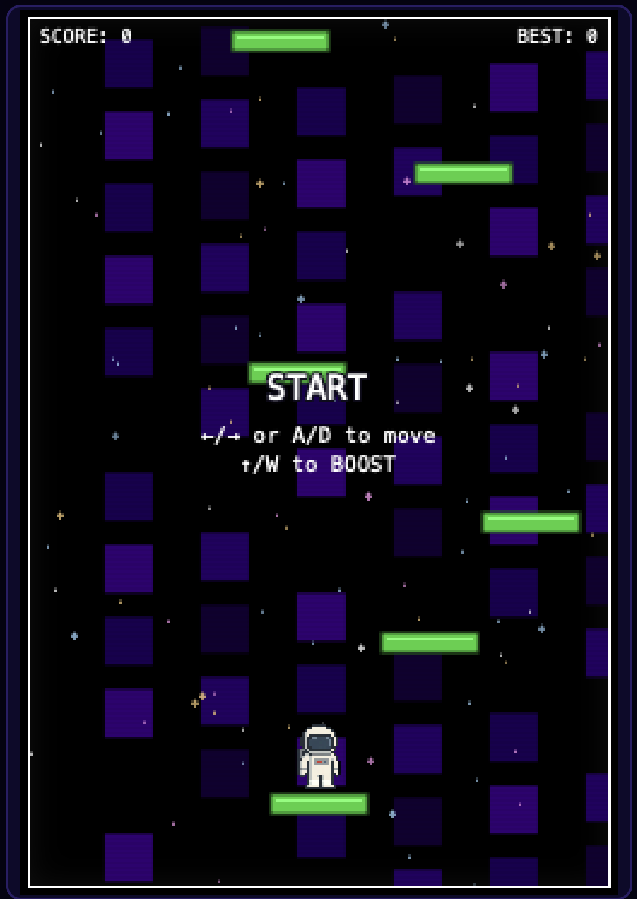

# 🚀 Space Hop  

---

## 🎮 Game Overview  
**Space Hop** is a vertical platform jumper inspired by *Doodle Jump*.  
You play as an astronaut bouncing higher and higher on platforms to avoid falling out of orbit.  

**Why I chose this game:**  
I’ve always liked retro space themes and wanted a fun arcade-style project to practice **HTML, CSS, and JavaScript**. Watching others build similar games with HTML canvas inspired me to create my own unique version.  

---

## 🌐 Getting Started  

- **Play the game here:** [Space Hop on GitHub Pages](https://alaalshehabii.github.io/Space-Hop/)  

- **Planning materials:**  
  Game idea, controls, and design choices were drafted from notes and references while following tutorials on **HTML Canvas** and building a **Doodle Jump clone**.  

---

## 🙌 Attributions  

This project was built with a mix of my own code and some external resources:  

- **Font:** [Press Start 2P](https://fonts.google.com/specimen/Press+Start+2P) from Google Fonts.  
- **Favicon:** Rocket emoji (🚀) embedded as inline SVG.  
- **Jump Sound Effect:** [Jumping Sound](https://freesound.org/people/Jerimee/sounds/535890/) by Jerimee on freesound.org (licensed for reuse).  
- **Tutorials Referenced:**  
  - General **HTML Canvas** tutorials on YouTube.  
  - Doodle Jump clone tutorials for understanding basic mechanics.  

---

## 🛠️ Technologies Used  

- **HTML** — structure and `<canvas>` rendering.  
- **CSS** — layout, HUD styling, retro design, responsive rules.  
- **JavaScript** — game logic, physics, input handling, rendering loop.  
- **Git & GitHub** — version control, commit history, and deployment with GitHub Pages.  

---

## 🚧 Next Steps (Future Goals)  

- Add enemies/obstacles (e.g., UFOs, meteors).  
- Introduce collectible power-ups (shields).  
- Add background music with mute toggle.  
- Implement online high-score leaderboard.  

---

## 📋 Pseudocode
// Game Setup
Create canvas and set width/height
Define colors, fonts, and messages
Load astronaut sprite and sound effect
// Platforms
Generate starting platforms
Randomly create new ones as player moves up
// Player
Draw astronaut on canvas
Apply gravity and jumping logic
Allow left/right movement with keys
// Game Loop
Update positions (player + platforms)
Check collisions between astronaut and platforms
Increase score when landing on new platforms
Redraw everything on screen
// Game Over
If astronaut falls below screen → show "Game Over"
Display restart button and allow replay

 ---

   

